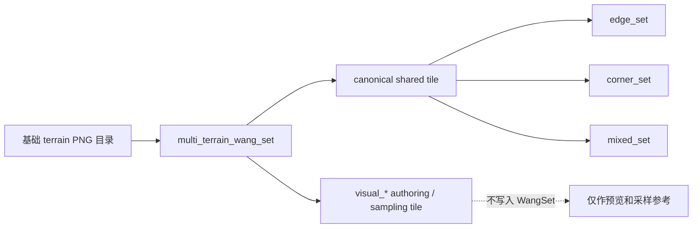
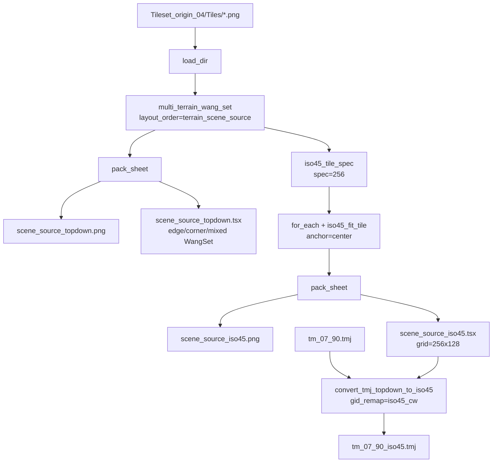
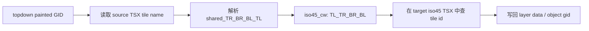
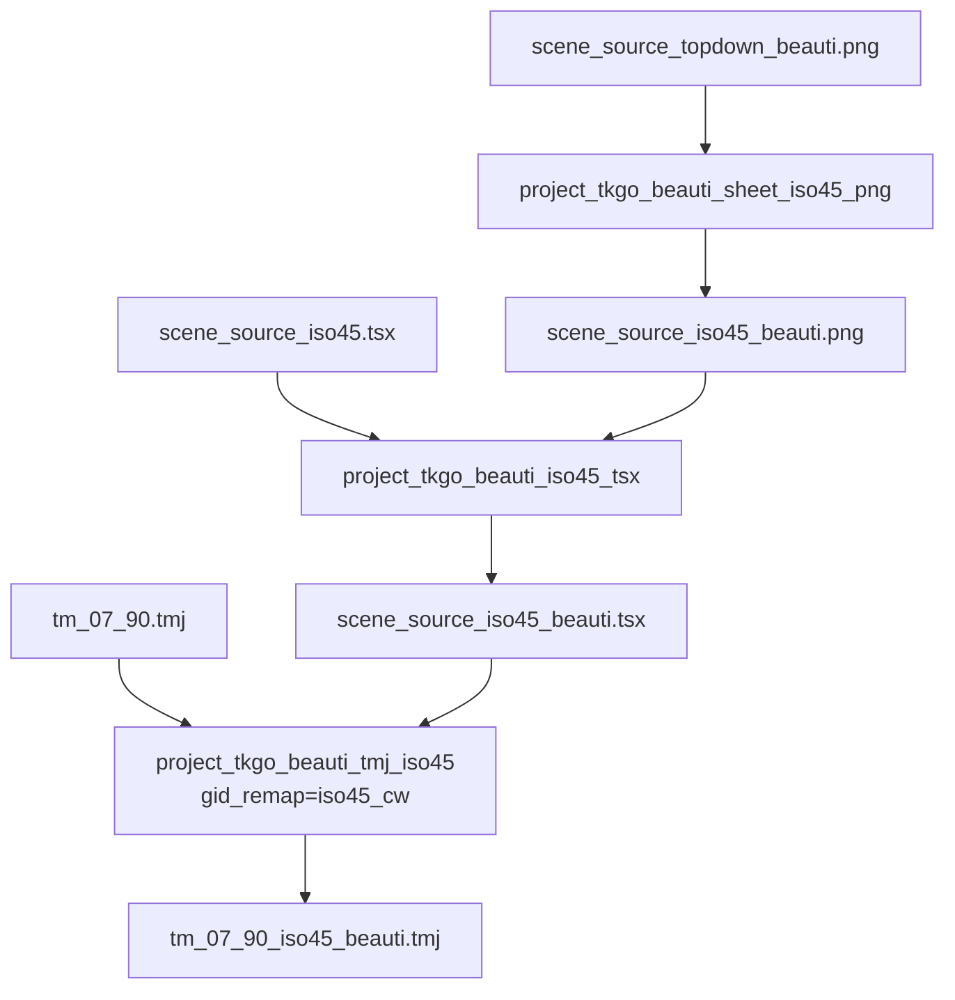

# Workflow 配方

> 25 个内置 workflow + 经典组合的速查。需要输入/输出截图时，先看 [输入 / 输出案例](05_examples.md)。


## 内置 workflow

| Workflow | 输入 | 输出 | 用途 |
| --- | --- | --- | --- |
| `topdown_to_iso` | 1 张 topdown 贴图 | 1 张 iso PNG | 视角转换 |
| `iso_to_topdown` | 1 张 iso 贴图 | 1 张 topdown PNG | 反向（还原 / 反推 footprint） |
| `3x3_split_then_iso` | 1 张 3×3 循环 tile | 9 张 iso 散文件 | 拆分 + 批量 iso |
| `3x3_split_then_iso_sheet` | 同上 | 1 PNG + 1 .tsx | 一条龙到 Tiled |
| `tile_repeat_3x3` | 1 张贴图 | 1 张大图 | 验证循环 / 铺地预览 |
| `tilesheet_split_connected` | 1 张透明背景 tilesheet | 多张独立 PNG | 按 alpha 连通区域自动裁出散排贴图 |
| `batch_images_to_tilesheet` | 多张独立图片 / 一个目录 | 1 张 sheet + 1 .tsx | 批量导入图片组成 Tiled tilesheet |
| `tileset_to_iso45_matrix` | 1 张已排好的 topdown tileset sheet | tile id 顺序不变的 iso45 matrix PNG | 已有地图从 topdown 迁移到 iso45 |
| `multi_tiletype_corner_set` | 3 张或更多基础 terrain PNG 目录 | Scene-source topdown sheet + edge/corner/mixed .tsx | 多 terrain 自动刷地形 / 美术 authoring 源图 |
| `multi_tiletype_corner_set_iso45_matrix` | 同上 | Scene-source iso45 matrix sheet + edge/corner/mixed .tsx | 与 topdown 版本 tile id 对齐的 isometric terrain tileset |
| `make_seamless` | 1 张贴图 | 无缝单图 + 3×3 验证图 | 把素材变成四方连续 |

| **`wang_2edge_set`** | 2 张底图（沙/水）| 1 张 sheet + 1 .tsx | 自动 Edge Set 过渡素材 |
| **`wang_2edge_corner_set`** | 2 张底图（沙/水）| 32 格 sheet + 1 .tsx | 非 iso，完整 Edge Set + Corner Set |
| **`wang_2edge_set_iso`** | 2 张底图（沙/水）| 1 张 iso sheet + 1 .tsx | 16 张 tile 分别 iso 化，适合做视觉 tileset |

| **`wang_2edge_set_iso_terrain`** | 2 张底图（沙/水）| 1 张 256×256 cell sheet + 1 .tsx | 自动 Edge Set，用于 Tiled Isometric Terrain Brush |
| **`wang_2edge_corner_set_iso_terrain`** | 2 张底图（沙/水）| 32 格 sheet + 1 .tsx | 同时自动 Edge Set + Corner Set |
| **`wang_2edge_big_iso`** | 2 张底图（沙/水）| 平面 3×3 图 + 1 张完整 iso 大图 | 先拼完整 3×3 图，再整体 iso 化 |
| `brush_variants_remap_tsx` | runtime tileset + brush variants tileset | brush .tsx + .remap.json | 编辑用 tileset 映射回运行时 tileset |
| `remap_tmj_gids` | .tmj/.tmx + .remap.json | 替换 GID 后的地图 | Tiled 导出后的 runtime 地图后处理 |
| `convert_tmj_topdown_to_iso45` | topdown .tmj + iso45 .tsx | iso45 .tmj | 只转换地图 metadata / tileset 引用 / 可选 GID 语义重映射 |
| `project_color_merge_iso45` | TKGO terrain PNG 目录 | topdown scene-source + iso45 scene-source .png/.tsx | 项目通用 Color Merge + ISO45 成套生成 |
| `project_tkgo_scene_source_iso45` | TKGO Tiles 目录 + `tm_07_90.tmj` | topdown .tsx + iso45 .tsx + `tm_07_90_iso45.tmj` | TKGO 当前地图的一键复现流程 |
| `project_tkgo_beauti_sheet_iso45_png` | `scene_source_topdown_beauti.png` | `scene_source_iso45_beauti.png` | 美术重绘整张 topdown sheet 后生成 iso45 PNG |
| `project_tkgo_beauti_iso45_tsx` | canonical `scene_source_iso45.tsx` + beauti PNG | `scene_source_iso45_beauti.tsx` | 复用 WangSet / tile name，派生美术版 TSX |
| `project_tkgo_beauti_tmj_iso45` | `tm_07_90.tmj` + beauti TSX | `tm_07_90_iso45_beauti.tmj` | 已绘制 topdown 地图切到美术版 iso45 tileset |

> 图片类 workflow 的实际输入/输出截图见 [输入 / 输出案例](05_examples.md)。`brush_variants_remap_tsx`、`remap_tmj_gids`、`project_tkgo_beauti_iso45_tsx` 和 `project_tkgo_beauti_tmj_iso45` 是结构化 tileset/map 后处理，不适合只用单张 PNG 纹理演示。

## 经典组合

### A0. 批量图片 → Tiled tilesheet

Web 端最快：点顶栏 **批量导入**，一次选择多张图片，工具会自动上传到一个临时目录并生成：

```text
load_dir → pack_sheet → build_tsx_sheet
```

CLI / 手动 workflow：

```yaml
- action: load_dir
  params: { path: ${input_dir}, pattern: "*", sort: true }
- action: pack_sheet
  params: { columns: ${columns:}, path: ${output:auto} }
- action: build_tsx_sheet
  params: { name: ${name:batch_tilesheet}, tile_names: true }
```

产物是一张 sheet PNG 和一份同目录 `.tsx`，可直接在 Tiled 打开。

### A0.5. 多 terrain 原图 → scene-source topdown / iso45 matrix 成套生成

适合一个目录里每张 PNG 都是一种四方连续基础地形的情况，例如 `grass` / `dirt` / `rock` / `water`。文件名排序决定 terrain 顺序；topdown 和 iso45 两次生成必须使用同一目录、同一排序、同一规格，才能保持 tile local id 一致。

默认 `layout_order=terrain_scene_source` 会把 sheet 排成可采样的合法场景源图：2tile 过渡保持成对场景块；3/4 tile 过渡生成由 Wang corner 约束推导的局部场景块。`visual_*` 上下文格只用于美术 authoring / 采样参考，不写入规则集；`.tsx` 只让 canonical shared tile 进入 `edge_set` / `corner_set` / `mixed_set`。



> 重要：目录里如果会混入下载包、旧输出或 `.tsx`，`load_dir.pattern` 必须写成 `*.png`，不要用 `*`，避免把 `.zip` 等非图片文件当成图片读取。

以 4 种 terrain、`64×64` topdown tile、`128×128` iso45 cell 为例：

```powershell
cd D:\Github\tiled\scripts
$src = "D:\UEAS\Game\TKGO\Content\Developers\ocarmihe\Collections\Tile\Tileset_origin_03\tiles"
$out = "D:\UEAS\Game\TKGO\Content\Developers\ocarmihe\Collections\Tile\Tileset_origin_03\generated"
New-Item -ItemType Directory -Force $out

python -m tiled_tools run multi_tiletype_corner_set `
  -v "terrain_dir=$src" `
  -v "pattern=*.png" `
  -v expected=4 `
  -v tile_width=64 `
  -v tile_height=64 `
  -v columns=32 `
  -v "output=$out\Tileset_origin_03_topdown_matrix.png" `
  -v "tsx=$out\Tileset_origin_03_topdown_matrix.tsx" `
  -v name=Tileset_origin_03_topdown_matrix

python -m tiled_tools run multi_tiletype_corner_set_iso45_matrix `
  -v "terrain_dir=$src" `
  -v "pattern=*.png" `
  -v expected=4 `
  -v tile_width=64 `
  -v tile_height=64 `
  -v spec=128 `
  -v columns=32 `
  -v anchor=center `
  -v "output=$out\Tileset_origin_03_iso45_matrix.png" `
  -v "tsx=$out\Tileset_origin_03_iso45_matrix.tsx" `
  -v name=Tileset_origin_03_iso45_matrix
```

4 种 terrain 会生成 `4^4 = 256` 张 canonical shared tile；同一批 tile ID 会同时写入 Edge Set、Corner Set 和 Mixed Set。scene-source sheet 还会追加 `visual_*` 上下文格用于预览和美术绘制，所以 sheet 的 `tilecount` 会大于 256，但 WangSet 只引用 canonical tile。`spec=128` 时，Tiled isometric map 使用 `Tile Width=128`、`Tile Height=64`。

项目专用 `project_color_merge_iso45` 会在同一条流程里先输出 topdown scene-source，再把同一批 tile 转成 iso45 输出，适合保持 authoring 源图和 Tiled isometric 版本同步：

```powershell
python -m tiled_tools run project_color_merge_iso45 `
  -v "topdown_output=$out\Tileset_origin_04_topdown_scene_source.png" `
  -v "topdown_tsx=$out\Tileset_origin_04_topdown_scene_source.tsx" `
  -v "output=$out\Tileset_origin_04_iso45_scene_source.png" `
  -v "tsx=$out\Tileset_origin_04_iso45_scene_source.tsx"
```

#### Project-only workflow：TKGO scene-source iso45

`project_tkgo_scene_source_iso45` 是当前 TKGO `Tileset_origin_04` 的固化流程，用来一键复现从 4 张基础 terrain 到可打开的 iso45 地图产物。它和 `project_color_merge_iso45` 的区别是：后者偏通用，默认只生成两套 tileset；前者把当前地图 `tm_07_90.tmj` 的转换也固定进同一条链路。



默认路径已经写在 `pipelines/project_tkgo_scene_source_iso45.yaml` 中，直接运行：

```powershell
cd D:\Github\tiled\scripts
python -m tiled_tools run project_tkgo_scene_source_iso45
```

默认输入：

```text
D:\UEAS\Game\TKGO\Content\Developers\ocarmihe\Collections\Tile\Tileset_origin_04\Tiles
D:\UEAS\Game\TKGO\Content\Developers\ocarmihe\Collections\Tile\tm_07_90.tmj
```

默认输出：

```text
Tileset_origin_04/TileSheet/scene_source_topdown.png
Tileset_origin_04/TileSheet/scene_source_topdown.tsx
Tileset_origin_04/TileSheet/scene_source_iso45.png
Tileset_origin_04/TileSheet/scene_source_iso45.tsx
tm_07_90_iso45.tmj
```

地图转换阶段的关键点是 `gid_remap=iso45_cw`。它不是只把 `.tmj` 的 `orientation`、`tilewidth`、`tileheight` 和 tileset source 改掉，而是会按 tile name 里的四角 terrain 语义重映射已绘制 GID：

```text
shared_TR_BR_BL_TL -> shared_TL_TR_BR_BL
```



这一步保证已经画好的 topdown map 在 iso45 tileset 下仍然使用正确的四角 terrain 方向。成功产物通常应满足：`orientation=isometric`、`renderorder=right-down`、`tilewidth=256`、`tileheight=128`，tileset 指向 `Tileset_origin_04/TileSheet/scene_source_iso45.tsx`。

#### Project-only workflow：TKGO beauti scene-source iso45 三段式

如果美术是基于 `scene_source_topdown.png` 重绘出 `scene_source_topdown_beauti.png`，不要重新从 4 张基础 terrain 生成组合。此时应该复用已经正确的 tile id 顺序和 WangSet 元数据，只替换视觉 sheet：



三步分别运行：

```powershell
cd D:\Github\tiled\scripts
python -m tiled_tools run project_tkgo_beauti_sheet_iso45_png
python -m tiled_tools run project_tkgo_beauti_iso45_tsx
python -m tiled_tools run project_tkgo_beauti_tmj_iso45
```

默认产物：

```text
Tileset_origin_04/TileSheet/scene_source_iso45_beauti.png
Tileset_origin_04/TileSheet/scene_source_iso45_beauti.tsx
tm_07_90_iso45_beauti.tmj
```

关键约束：

- `scene_source_topdown_beauti.png` 必须与原 `scene_source_topdown.png` 保持相同尺寸、列数、tile 大小和 tile id 顺序。
- `project_tkgo_beauti_sheet_iso45_png` 默认 `tile_count=1227`、`columns=15`，对齐 canonical `scene_source_iso45.tsx`。
- `project_tkgo_beauti_iso45_tsx` 只修改 `tileset.name` 与 `<image source/width/height>`，不改 tile name、properties 或 `edge_set` / `corner_set` / `mixed_set`。
- `project_tkgo_beauti_tmj_iso45` 仍默认使用 `gid_remap=iso45_cw`，不能用手工只改 metadata 替代。

#### 只转换已有地图：convert_tmj_topdown_to_iso45

如果 topdown / iso45 tileset 已经存在，只想转换地图，使用 `convert_tmj_topdown_to_iso45`：

```powershell
python -m tiled_tools run convert_tmj_topdown_to_iso45 `
  -v "map_path=D:\UEAS\Game\TKGO\Content\Developers\ocarmihe\Collections\Tile\tm_07_90.tmj" `
  -v "target_tileset=D:\UEAS\Game\TKGO\Content\Developers\ocarmihe\Collections\Tile\Tileset_origin_04\TileSheet\scene_source_iso45.tsx" `
  -v "output=D:\UEAS\Game\TKGO\Content\Developers\ocarmihe\Collections\Tile\tm_07_90_iso45.tmj" `
  -v gid_remap=iso45_cw `
  -v gid_remap_wangset=mixed_set
```

`gid_remap` 常用取值：

| 值 | 用途 |
| --- | --- |
| `none` | 只改 metadata 和 tileset 引用，保留 layer data。仅当 topdown / iso45 的 local tile ID 和方向语义完全一致时使用。 |
| `edge_canonical` | 兼容旧的 duplicated edge WangSet，把同一 edge 候选归一到 canonical tile。 |
| `iso45_cw` | TKGO scene-source 地图迁移推荐值，按 `shared_TR_BR_BL_TL -> shared_TL_TR_BR_BL` 旋转四角语义。 |

如果已有 topdown 地图要迁移到 iso45：优先走 `convert_tmj_topdown_to_iso45` 或 `project_tkgo_scene_source_iso45`，不要手工只改 `orientation` / `tilewidth` / `tileheight`。手工改 metadata 不会处理已绘制 tile 的四角语义。

完整操作手册见 [输入 / 输出案例](05_examples.md) 的 `multi_tiletype_corner_set` / `multi_tiletype_corner_set_iso45_matrix` 小节。

### A1. 透明 tilesheet → 多张独立 PNG

适合一张透明背景大图里已经散排了多个 sprite / item / decoration，彼此之间有透明间隔，需要反向裁成独立贴图。

Web 端：上传这张 PNG → workflow 选 `tilesheet_split_connected` → ▶ 运行。

CLI / 手动 workflow：

```yaml
- { action: load, params: { path: ${input} } }
- action: split_connected
  params:
    min_alpha: ${min_alpha:1}      # alpha >= 此值视为有效像素
    min_width: ${min_width:1}      # 过滤太小的噪点
    min_height: ${min_height:1}
    padding: ${padding:0}          # 每张裁剪图额外保留透明边
    connectivity: ${connectivity:8} # 8=斜角接触也算同一张；4=只算上下左右
    sort: row-major                # 从上到下、从左到右命名 001/002/...
- action: save_all
  params:
    dir: ${output_dir:auto}
    prefix: ${prefix:}
    pattern: "{prefix}_{name}.png"
```

如果美术图里两个 sprite 的非透明像素接触或重叠，它们会被视为同一张；需要先在原图中留出至少 1px 透明间隔，或改用固定网格切割类流程。

### A. Topdown → Iso 单图


```yaml
- { action: load, params: { path: ${input} } }
- action: topdown_to_iso
  params:
    anchor: bottom-center   # 站立物：bottom-center；地面 tile：center
    y_scale: 0.5            # 2:1 dimetric；真 60° iso 用 0.5774
    trim: true
- { action: save, params: { path: ${output:auto} } }
```

### B. 3×3 循环 tile → 9 张 iso 散文件

```yaml
- { action: load, params: { path: ${input} } }
- action: split_3x3
  params: { mode: equal }
- action: for_each
  params:
    source: tiles
    steps:
      - action: topdown_to_iso
        params: { anchor: center, y_scale: 0.5, trim: false }
- action: save_all
  params:
    dir: ${output_dir:auto}
    pattern: "{prefix}_iso_{name}.png"
```

### C. 3×3 循环 tile → Tiled tileset 一条龙

```yaml
- { action: load, params: { path: ${input} } }
- { action: split_3x3, params: { mode: equal } }
- action: for_each
  params:
    source: tiles
    steps:
      - action: topdown_to_iso
        params: { anchor: center, y_scale: 0.5, trim: false }
- action: pack_sheet
  params: { columns: 3, spacing: 0, margin: 0, path: auto }
- action: build_tsx_sheet
  params: { name: ${name:grass_iso}, tile_names: true }
```

### D. Wang 2-edge 过渡素材（沙↔水 等）

详细见 [Wang 2-edge 专题](#wang-2-edge-过渡素材专题)，最简形态：

```yaml
- action: gen_default_masks         # 或换成 load_dir 读自己画的蒙版
  params: { size: 32, half_extent: 0.5 }
- action: mask_blend_set
  params:
    foreground: ${fg}               # sand_tile.png
    background: ${bg}               # water_tile.png
    resample: nearest
- action: pack_sheet
  params: { columns: 4, path: auto }
- action: build_tsx_sheet
  params: { name: ${name:wang_2edge}, tile_names: true }
```

### D1. Wang 2-edge → Tiled Isometric Terrain Brush tileset

适合真正拿到 Tiled 的 Isometric Map 里用 Terrain Brush 刷地形。关键点：用 `iso45_tile_spec.preset` 一个下拉预设控制最终规格；默认 `256` 表示 tileset 单元 `256×256`，`.tsx` 写入 `isometric grid=256×128` 和 `tileoffset.y=64`。切到 `128/512` 时这些值会一起联动。

```yaml
- action: gen_default_masks
  params: { size: 32, half_extent: 0.5 }
- action: mask_blend_set
  params: { foreground: ${fg}, background: ${bg}, resample: nearest }
- action: iso45_tile_spec
  params: { preset: ${spec:256} }
- action: for_each
  params:
    source: tiles
    steps:
      - action: iso45_fit_tile
        params: { preset: context, anchor: center, resample: bicubic }
- action: pack_sheet
  params: { columns: 4, path: ${output:auto} }
- action: build_tsx_sheet
  params:
    name: ${name:wang_2edge_iso_terrain}
    terrain_spec: context
```

在 Tiled 里新建地图：默认 `Orientation=Isometric`，`Tile Width=256`，`Tile Height=128`；如果你在下拉里选了 `128/512`，地图 Tile Width/Height 也对应改为 `N/N/2`。注意：tileset 单元是 `N×N`，但 terrain overlay / map grid 是 `<grid orientation="isometric" width="N" height="N/2"/>`。


### D2. Wang 2-edge 先拼完整 3×3 大图，再整体 iso 化


适合做美术预览或一张完整的大块地形图。关键区别是：**不能直接用 `pack_sheet` 的 0..15 查表顺序**，因为那只是 tileset 索引表，相邻格子的边不一定匹配。这里先用 `wang_2edge_compose_map` 按有效 code 矩阵取 tile，保证共享边一致，再对整张图做 `topdown_to_iso`。默认 `lake3` 会反转外围 8 格方向，同时四个角都使用拐角过渡 tile。


```yaml
- action: gen_default_masks
  params: { size: 32, half_extent: 0.5 }
- action: mask_blend_set
  params: { foreground: ${fg}, background: ${bg}, resample: nearest }
- action: wang_2edge_compose_map
  params: { pattern: lake3, wrap: true }


- action: save
  params: { path: ${flat_output:auto} }
- action: topdown_to_iso
  params: { anchor: center, y_scale: 0.5, trim: false }
- action: scale
  params: { size: [${target:288}, ${half_target:144}] }
- action: square_canvas
  params: { size: ${target:288}, anchor: bottom-center, background: [0, 0, 0, 0] }

- action: save
  params: { path: ${output:auto} }
```

`pattern` 可选：`lake3`（默认，反转外围 8 格方向）、`island3`（反相，foreground 在中间）、`island4` / `lake4`（更大中心区，但外角纯色）、`lookup4`（原始 0..15 查表顺序，仅对照用，不和谐）。


> 注意：这种产物是“完整大图 / mock-up”，不是可逐格刷地形的 Tiled Edge Set tileset。要 terrain brush 仍用 `wang_2edge_set` 或 `wang_2edge_set_iso`。

### E. 验证你的循环 tile 真的无缝


```yaml
- { action: load, params: { path: ${input} } }
- action: tile_repeat
  params: { count: 3, gap: 0 }      # gap=1 可看清单格边界
- { action: save, params: { path: ${output:auto} } }
```

肉眼看接缝处有没有可见竖/横/十字裂缝。有就回去修原图，无缝才能进 wang 链。

### F. Iso 资产反推 footprint

```yaml
- { action: load, params: { path: ${input} } }
- action: iso_to_topdown
  params:
    y_scale: 2.0                    # dimetric；60° 真等距用 1.7321
    resample: nearest               # 像素美术务必
    trim: true
    pad_before_scale: 16            # 输入紧贴画布边时设 > 0
- { action: save, params: { path: ${output:auto} } }
```

## 自己保存的 workflow

存在当前工作目录的 `workflows/<id>.json`，结构：

```json
{
  "name": "我的工作流",
  "description": "可选说明",
  "steps": [
    {"action": "load", "params": {"path": "${input}"}},
    {"action": "rotate", "params": {"angle": 90}}
  ]
}
```

和内置 YAML 等价，CLI 也能直接吃同样的 JSON。在前端「★ 存为 workflow」后会自动落盘到这里，下次启动 server 时自动列在下拉里。

